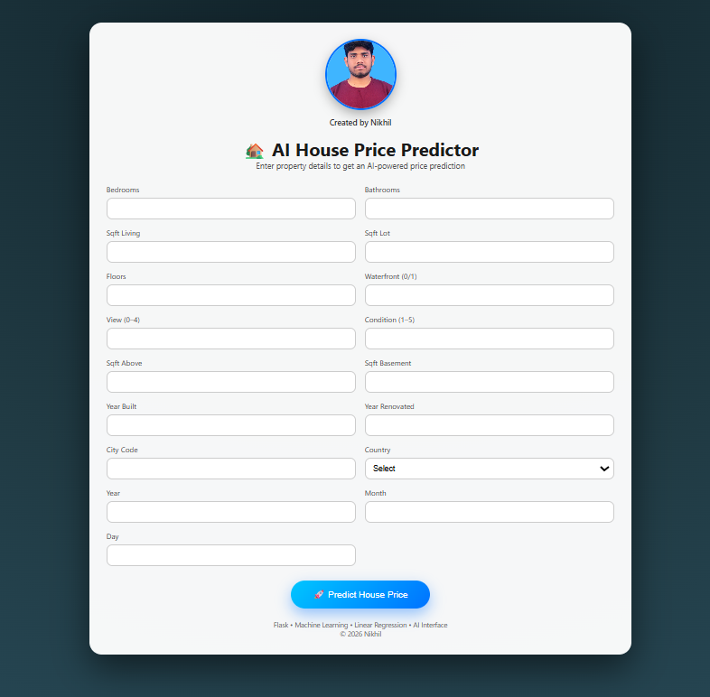
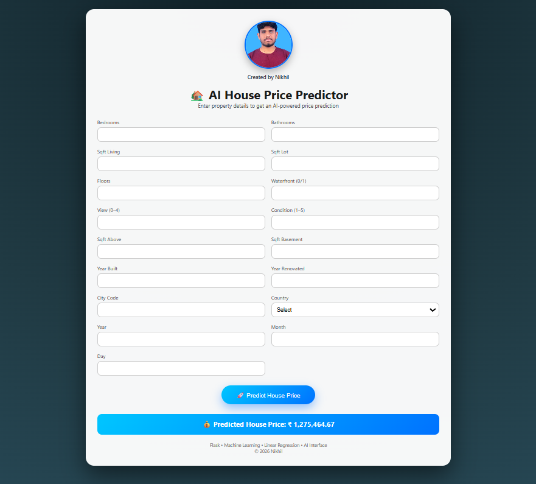

<!DOCTYPE html>
<html lang="en">
<head>
<meta charset="UTF-8">
<meta name="viewport" content="width=device-width, initial-scale=1.0">
<title>House Price Prediction Project</title>

</head>

<body>

<header>
    <h1>🏠 AI House Price Predictor</h1>
    
Machine Learning Web Application using Custom Linear Regression & Flask

</header>

<section>
<h2>📌 Project Overview</h2>

This project predicts house prices using a custom-built Linear Regression model and deploys it using Flask and Render.

<ul>
<li>Real-time house price prediction</li>
<li>17 input features</li>
<li>Custom Linear Regression using SVD</li>
<li>Deployed on Render</li>
</ul>
</section>

<section>
<h2>📸 Application Screenshots</h2>

<h3>1️⃣ Home Interface</h3>

    

<h3>2️⃣ Input Filled & Loading State</h3>

    

<h3>3️⃣ Prediction Output Result</h3>

    

</section>

<section>
<h2>📊 Dataset Description</h2>
<ul>
<li><strong>Dataset:</strong> House Sales in King County, USA</li>
<li><strong>Total Records:</strong> 21,613</li>
<li><strong>Features:</strong> 18 columns</li>
<li><strong>Time Period:</strong> May 2014 – May 2015</li>
</ul>
</section>

<section>
<h2>💻 Technology Stack</h2>
<ul>
<li><strong>Backend:</strong> Python, Flask, Scikit-learn, NumPy, Pandas</li>
<li><strong>Frontend:</strong> HTML5, CSS3</li>
<li><strong>Deployment:</strong> Render, Gunicorn</li>
<li><strong>Version Control:</strong> Git & GitHub</li>
</ul>
</section>

<section>
<h2>⚙ Implementation Steps</h2>

<h3>Environment Setup</h3>
<pre>
python -m venv venv
venv\Scripts\activate
pip install flask numpy pandas scikit-learn gunicorn
</pre>

<h3>Run Application</h3>
<pre>
python app.py
</pre>

Access at: <code>http://localhost:5000</code>

</section>

<section>
<h2>🚀 Deployment</h2>

<ul>
<li>Push project to GitHub</li>
<li>Create Web Service on Render</li>
<li>Build Command: <code>pip install -r requirements.txt</code></li>
<li>Start Command: <code>gunicorn app:app</code></li>
</ul>

<strong>Live URL:</strong> https://house-price-predictor.onrender.com

</section>

<section>
<h2>🏁 Conclusion</h2>

This project demonstrates a complete machine learning pipeline from data preprocessing to web deployment.

</section>

<footer>

👨‍💻 Project By: A. Nikhil Goud

© 2026 Nikhil | Flask • Machine Learning • Linear Regression

</footer>

</body>
</html>
